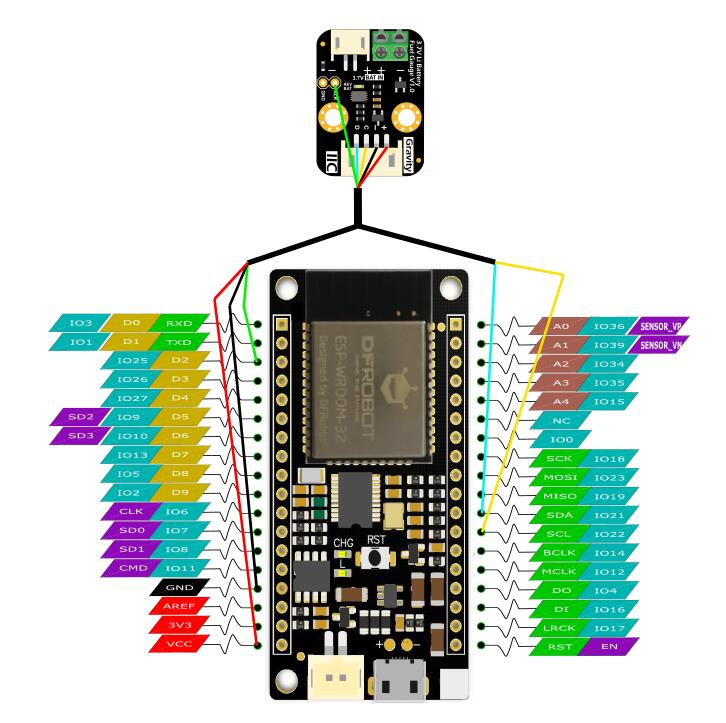

# DFRobot_MAX17043 Gravity：3.7V Li Battery Fuel Gauge

The MAX17043 is ultra-compact, low-cost,host-side fuel-gauge systems for lithium-ion (Li+) batter-ies in handheld and portable 
equpiment.It employs Gravity I2C interface,ultra-low opearting current, and real-time tracking of the relative state of charge 
(SOC) of the battery through Maxim's patented algorithm,eliminating the need for full-to-empty relearning and offset accumualtion 
errors.Plug and play to accurately measure the voltage and remaining power of the battery. The module  also features as a low 
battery power alert interrupt function.  When the battery power falls below specified threshold, the ALR pin generates a falling 
pluse to trigger the external interrupt of the controller.One thing should mention that the default value of the battery low power
interrupt alert threshold is 32%, this threshold can be set by the function setInterrupt().

When connecting , it is necessary to pay attention to the correspondence among pins, the connection diagram is as fellows.
<br>

=======
* ESP32
<br>

<br>


## DFRobot_MAX17043.py Library for microPython
---------------------------------------------------------
Provides a microPython library for reading and interperting MAX17043 data over I2C.

## Table of Contents

* [Installation](#installation)
* [Methods](#methods)

## Installation

To use this library download the zip file, uncomperss it to a folder named DFRobot_MAX17043 in your upyCraft workspace.

## Methods

```python

#
 # @brief create MAX17043 object
 #
 # @return MAX17043 object
#
DFRobot_MAX17043();

#
 # @brief MAX17043 begin and test moudle
 #
 # @return result:        0: successful
 #                       -1: faild
#
def begin();

#
 # @brief read battery voltage in mV
 #
 # @return voltage in mV
#
def readVoltage();

#
 # @brief read battery remaining capacity in percentage
 #
 # @return battery remaining capacity in percentage
#
def readPercentage();

#
 # @brief set MAX17043 interrput threshold
 #
 # @param per       interrupt threshold as %1 - %32 (integer)
#
def setInterrupt(per);

#
 # @brief clear MAX17043 interrupt
 # 
#
def clearInterrupt();

#
 # @brief set MAX17043 in sleep mode
 # 
#
def setSleep();

#
 # @brief weak up MAX17043
 # 
#
def setWeakUp();

```

## Credits

Written by DFRobot, 2018. (Welcome to our [website](https://www.dfrobot.com/))
