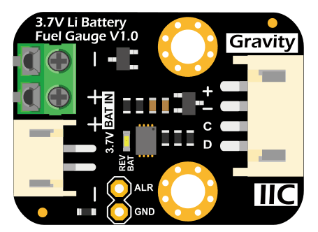

# DFRobot_MAX17043

* [中文版](./README_CN.md)

The MAX17043 is ultra-compact, low-cost,host-side fuel-gauge systems for lithium-ion (Li+) batter-ies in handheld and portable 
equpiment.It employs Gravity I2C interface,ultra-low opearting current, and real-time tracking of the relative state of charge 
(SOC) of the battery through Maxim's patented algorithm,eliminating the need for full-to-empty relearning and offset accumualtion 
errors.Plug and play to accurately measure the voltage and remaining power of the battery. The module  also features as a low 
battery power alert interrupt function.  When the battery power falls below specified threshold, the ALR pin generates a falling 
pluse to trigger the external interrupt of the controller.One thing should mention that the default value of the battery low power
interrupt alert threshold is 32%, this threshold can be set by the function set_interrupt().

 

## Product Link（[https://www.dfrobot.com/product-1734.html](https://www.dfrobot.com/product-1734.html)）
    SKU: DFR0563

## Table of Contents
* [Summary](#summary)
* [connection](connection)
* [Installation](#installation)
* [Methods](#methods)
* [Compatibility](#compatibility)
* [History](#history)
* [Credits](#credits)

## Summary

Provides an Raspberry pi library for reading and interperting MAX17043 data over I2C.

## Connection
Wires of the same color are linked together,and We only exemplify how these three boards are connected to the Fuel Gauge.
When connecting , it is necessary to pay attention to the correspondence among pins, the connection diagram is as fellows.

* Raspberry Pi
<br>

<br>

## Installation

Download and install smbus library on Raspberry pi. Steps to install smbus are provided at:

```python
$> sudo apt-get install -y python-smbus 
$> sudo apt-get install -y i2c-tools 
```

1. To use this library, first download the library file<br>
```python
sudo git clone https://github.com/DFRobot/DFRobot_MAX17043
```
2. Open and run the routine. To execute a routine demo_x.py, enter python demo_x.py in the command line. For example, to execute the demo_read_and_int.py.py routine, you need to enter :<br>

```python
python demo_read_and_int.py.py 
or
python2 demo_read_and_int.py.py 
```

## Methods

```python
  '''!
    @brief MAX17043 begin and test moudle
    @return initialization result:
    @retval 0     successful
    @retval -1     faild
  '''
  def begin(self):
    
  '''!
    @brief read battery voltage in mV
    @return voltage in mV
  '''    
  def read_voltage(self):
    
  '''!
    @brief read battery remaining capacity in percentage
    @return battery remaining capacity in percentage
  '''
  def read_percentage(self):
  '''!
    @brief set MAX17043 interrput threshold
    @param per       interrupt threshold as %1 - 32% (integer)
  '''
  def set_interrupt(self, per):
    
  '''!
    @brief clear MAX17043 interrupt.
  '''
  def clear_interrupt(self):
    
  '''!
    @brief set MAX17043 in sleep mode.
  '''
  def set_sleep(self):
    
  '''!
    @brief wake up MAX17043.
  ''' 
  def set_wakeup(self):
    

```

## Compatibility

| 主板         | 通过 | 未通过 | 未测试 | 备注 |
| ------------ | :--: | :----: | :----: | :--: |
| RaspberryPi2 |      |        |   √    |      |
| RaspberryPi3 |      |        |   √    |      |
| RaspberryPi4 |  √   |        |        |      |

* Python 版本

| Python  | 通过 | 未通过 | 未测试 | 备注 |
| ------- | :--: | :----: | :----: | ---- |
| Python2 |  √   |        |        |      |
| Python3 |      |        |   √    |      |

## History

- 2018/04/14 - Version 1.0.0 released.

## Credits

Written by ouki.wang(ouki.wang@dfrobot.com), 2018. (Welcome to our [website](https://www.dfrobot.com/))
